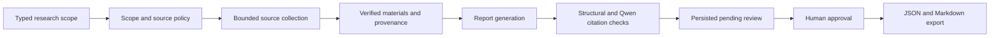

# MedEvidence

**A local research workspace for traceable, multi-source drug-safety evidence.**

MedEvidence collects public source material, builds source-attributed reports,
checks citations in two stages, and requires explicit human approval before export.
The reference workflow covers semaglutide, tirzepatide, and gastrointestinal adverse
reactions. The current local input catalog is deliberately limited to these drugs
and nausea, vomiting, and diarrhoea.

**Status:** runnable local development delivery. Offline and PostgreSQL integration
checks passed; this is not a held-out release evaluation or clinical validation.
See [delivery status and evidence](docs/DELIVERY_STATUS.md).

## What it does

- Collects bounded PubMed literature, current DailyMed labels, and FAERS aggregates.
- Searches an explicitly configured, approved local CADEC corpus as auxiliary material.
- Preserves source identity, query, snapshot, retrieval time, limitations and provenance.
- Uses **DeepSeek Flash** for report generation and **Qwen `qwen3.8-max-0902`** for
  separate semantic citation checking. Application code owns the safety/review policy.
- Persists workflow checkpoints and source/model receipts; ambiguous external attempts
  are not silently resent after a restart.
- Exposes a FastAPI application, Streamlit interface and read-only MCP tools.
- Supports exact-content human review and idempotent JSON/Markdown export.



## Source roles

| Source | Role | Important boundary |
|---|---|---|
| PubMed | Literature and exact abstract spans | Missing or excluded material does not become evidence |
| DailyMed | Current product labels and source-native sections | Historical date-range selection is not supported |
| FAERS / openFDA | Bounded spontaneous-report aggregates | Counts do not establish incidence, causality or safety rankings |
| CADEC | Local auxiliary NLP/retrieval references | Metadata-only report material; no clinical claim permissions |

Missing, partial, failed and policy-skipped sources remain distinguishable. The
application does not provide diagnosis, treatment, dosage, emergency guidance or
individual medical advice.

## Run locally

The verified environment is Windows with PowerShell 7.6 LTS, Python 3.12.13,
uv 0.11.32 and Docker Desktop. Exact Python dependencies are pinned in
[pyproject.toml](pyproject.toml) and [uv.lock](uv.lock).
Use `pwsh`; Windows PowerShell 5.1 and `powershell.exe` are unsupported by the
repository scripts. The bootstrap installs the pinned Python and dependency groups:

```powershell
pwsh -NoLogo -NoProfile -File ./scripts/bootstrap.ps1
```

Then follow the [local runbook](docs/LOCAL_RUNBOOK.md) to configure PostgreSQL,
server-only API credentials, snapshot storage and optional CADEC assets. Once the
environment is configured:

```powershell
$env:MEDEV_CODE_REVISION = git rev-parse HEAD
uv run --locked --no-sync alembic upgrade head
uv run --locked --no-sync python -m medevidence.local_api
```

In a second terminal:

```powershell
uv run --locked --no-sync streamlit run frontend/app.py --server.address 127.0.0.1 --server.port 8501
```

Open **[localhost:8501](http://127.0.0.1:8501)**. API listens on port 8000. Both
bind to loopback. Docker Compose supplies PostgreSQL and optional Qdrant
infrastructure; API/UI run in the pinned Python environment.

Configured read-only MCP:

```powershell
uv run --locked --no-sync python -m medevidence.local_mcp
```

The separate `scripts/preview_api.py` and `medevidence.mcp_server` entry points are
unconfigured preview/discovery shells. Use the configured commands above for research.

## Data and credentials

`.env.example` is a placeholder-only infrastructure template. Application credentials
come from the server process environment, not from browser code. The runtime does
not automatically read `.env` or a credential CSV.

Raw CADEC assets, local databases, API keys, exports and machine-local receipts are
not distributed in Git. CADEC requires separately provisioned exact assets; see
[ADR-043](docs/decisions/ADR-043-cadec-recovered-asset-profile.md). Without them it is
visibly skipped. Its original archive was recovered byte-for-byte; the missing
project manifest has a distinct audited recovery identity, not a fabricated old hash.

## Validation

The last reviewed implementation snapshot passed:

| Gate | Result |
|---|---:|
| Offline unit and contract tests | 5,054 passed; 75% coverage |
| Source PostgreSQL integration | 15 passed |
| Application PostgreSQL integration | 3 passed |
| PostgreSQL migration tests | 8 passed |
| Ruff, formatting and mypy | Passed |
| Independent code review and terminal audit | Passed for local development delivery |

The complete Qwen Development comparison agreed with **33/36** fixed human labels
(91.67%) and met the unchanged per-class and zero-false-supported thresholds. Runtime
request bytes and saved responses were replayed for all 36 cases. This is a small
Development set, not an independent Holdout score or evidence of general superiority.

Online API responses were mocked in final application integration tests; the restored
CADEC asset was exercised locally. Live multi-source freshness and Holdout-20 acceptance
are not claimed. [Evidence identities and limitations](docs/DELIVERY_STATUS.md) distinguish
these checks from public deployment or clinical readiness.

Run the offline gates:

```powershell
uv run --locked --no-sync ruff check .
uv run --locked --no-sync ruff format --check .
uv run --locked --no-sync mypy src
uv run --locked --no-sync pytest tests/unit tests/contract --disable-socket --cov=medevidence --cov-report=term-missing
```

PostgreSQL tests require a separate disposable database. They must not use the
application database or preserved provider-attempt ledger. Repository CI runs
Windows quality checks and the infrastructure contract; CI status must be checked
on the actual uploaded commit.

## Project layout

| Path | Responsibility |
|---|---|
| `src/medevidence/domain`, `connectors`, `ingestion`, `retrieval` | Typed source contracts, bounded I/O, normalization and retrieval |
| `src/medevidence/tools`, `orchestration` | Application operations, citation policy and workflow |
| `src/medevidence/infrastructure`, `persistence` | Replaceable runtime adapters and durable storage |
| `src/medevidence/api`, `mcp_server`, `frontend/` | API, read-only MCP and Streamlit interfaces |
| `evaluation/`, `tests/` | Versioned evaluation and deterministic/integration checks |
| `docs/decisions/`, `docs/reviews/`, `.delivery/` | Decisions and historical review records |

The retrieval evaluation harness is separate from the current source-collection
runtime; benchmark results do not imply that every live research query uses dense
retrieval or a reranker.

## Documentation

- [Local setup and operations](docs/LOCAL_RUNBOOK.md)
- [Delivery status and evidence](docs/DELIVERY_STATUS.md)
- [Architecture](docs/ARCHITECTURE.md), [requirements](docs/PRD.md) and [traceability](docs/TRACEABILITY_MATRIX.md)
- [Source semantics](docs/DATA_SOURCES.md), [evaluation](docs/EVALUATION_PLAN.md) and [security](docs/SECURITY.md)
- [Decision index](docs/decisions/README.md)
- [Historical milestone narrative](docs/history/README-before-local-delivery.md)

Historical failed runs and prior milestones remain preserved; they do not override
the current delivery status or become successful evidence retroactively.
